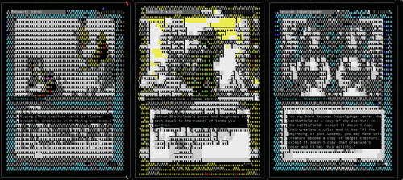

ccg-cli
============================


A framework for display and deck building on the command-line.

I used to play Magic when it was new along with Rage and some other CCGs and even was the subject for a card in the Arcadia card game. Now that I'm a parent, I taught my daughter Magic and now this is the perfect opportunity to teach software, design and ownership.

The library is currently in transition as it shifts to ESM in anticipation of [ascii-art](https://www.npmjs.com/package/ascii-art)'s [ESM rebuild](https://github.com/orgs/ansi-art/repositories). Card abstraction is working, but CL client, and deck are unfinished.

Someday we may even integrate matchmaking and basic game mechanics.

Usage
-----


Magic[TBD]
----------

Display an image of the `Vesuvan Doppelganger`

```bash
ccg -g mtg lookup "Vesuvan Doppelganger"
```

List the cards from `Arabian Nights` and `Unlimited` which are still legal to play (filters are [Mongo Query Documents](https://docs.mongodb.com/manual/tutorial/query-documents/)).

```bash
ccg -g mtg list "set:arabian nights+set:unlimited edition" -f '{"legalities.standard":{"$eq":"legal"}}'
```

Testing
-------

Run the es module tests to test the root modules
```bash
npm run import-test
```

to run the same test inside docker:
```bash
npm run container-test
```

Run the commonjs tests against the `/dist` commonjs source (generated with the `build-commonjs` target).
```bash
npm run require-test
```

Development
-----------
All work is done in the .mjs files and will be transpiled on commit to commonjs and tested.

If the above tests pass, then attempt a commit which will generate .d.ts files alongside the `src` files and commonjs classes in `dist`

